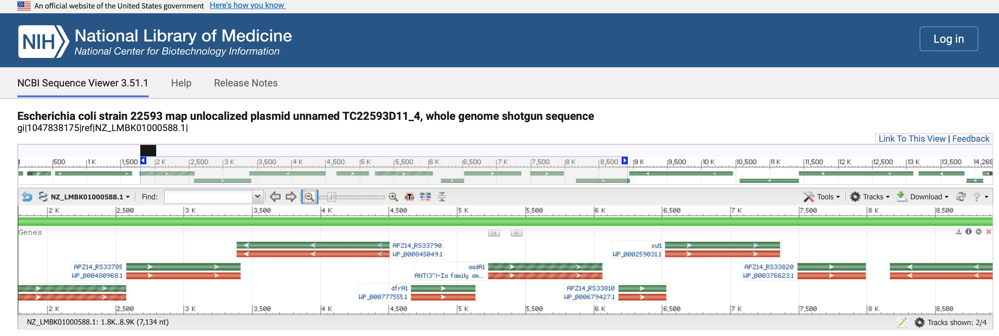
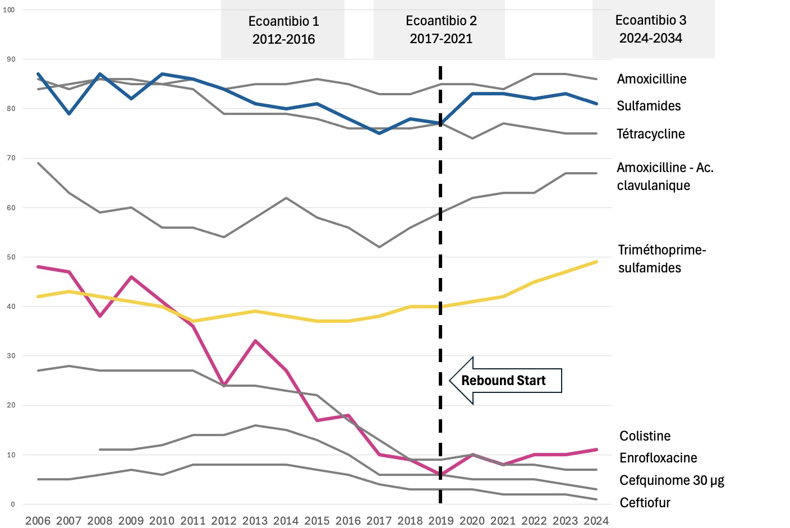

# Project 2: Validation Using French Veal Surveillance Data

**Target Data:** ANSES historical isolate (2016)

**Analysis Type:** Genomic confirmation of the 'Integron Trap' in field data.

## 1. Objective
To validate whether the co-selection mechanism (between Sulfonamide and Trimethoprim resistance) identified in the model strain of the Project 1 is also present in actual field isolates retrieved from French livestock.

## 2. Dataset Information
In order to compare my concept to actual situations, I chose a genomic dataset that the ANSES Lyon team had already published.

* **Study:** Valat, Haenni, Madec et al., 2016.
* **Source:** Veal Calves in France
* **Accession:** `LMBK01000000` 
* **Isolate ID:** E. coli strain 22593

## 3. Methodology
1.  Comprehensive profiling by ResFinder was carried out to identify variants or alternative resistance genes.
2.  Targeted search by MyDatabase Finder was carried out to screen for specific markers by using my custom database for `mcr-1`, `sul1`, `dfrA17`, which I created for the Project 1.
3.  Visual verification by NCBI Graphical Sequence Panel was carried out to confirm and visualize the physical linkage on the chromosome/plasmid.

## 4. Results: Multi-Layered Trap Structures
The analysis revealed that the isolate from veal calves in France carries **three distinct co-selection pairs**. This indicates a highly stabilized multidrug-resistant genotype.

### 4.1. Detection of Critical Markers
**`mcr-1` (Colistin resistance)** and **`sul1` (Sulfonamide resistance)** were detected in this French isolate using my custom database.

### 4.2. Gene Substitution (dfrA17 → dfrA1/dfrA36)
The model strain (EC590) carried dfrA17. The French isolate from this project, however, carries the dfrA1 and dfrA36 variants instead, according to ResFinder. This demonstrates the adaptive capacity of the trap mechanism, capable of capturing different but available *dfr* variants while maintaining the core *sul1*. 

### 4.3. Identification of Three "Trap" Pairs
The analysis revealed that three different genomic locations where Sulfonamide and Trimethoprim resistance genes are physically linked. This was determined by examining their locations. This redundancy makes losing the resistance genes extremely difficult.

* **Pair A:**
    * **Location:** `NZ_LMBK01000588.1`
    * **Genes:** **`sul1`** + **`dfrA1`**
    * **Context:** A typical Class 1 Integron structure.
* **Pair B:**
    * **Location:** `NZ_LMBK01000312.1`
    * **Genes:** **`sul1`** + **`dfrA1`**
    * **Context:** Reaffirms the prevalence of this combination.
* **Pair C:**
    * **Location:** `NZ_LMBK01000112.1`
    * **Genes:** **`sul2`** + **`dfrA36`**
    * **Context:** `sul2` is also involved in co-selection traps with different partners.

### 4.4. Visual Verification (Pair A)
The physical linkage of Pair A on the contig was confirmed via the visualization by using NCBI Graphical Sequence Panel. 

* **Contig:** NZ_LMBK01000588.1
* **Coordinates:** `dfrA1` (4660..5133) and `sul1` (6522..7361)
* **Distance:** Approx. 1.4kb 

## 5. Conclusion 

### 5.1. Genomic Validation
This analysis proves that the "Integron Trap" exists in French livestock. The physical linkage of sul1 and dfrA1 on a plasmid in the 2016 isolate demonstrates that the co-selection mechanism was already established and mobile a decade ago.

### 5.2. The "EcoAntibio 2" Paradox (RESAPATH Data)
Recent surveillance data I retrieved from RESAPATH reveals an alarming sign of resistance. Although the French national plan "EcoAntibio 2" greatly contributed to reducing colistin resistance over dacades, a concerning rebound has been observed since 2019. As shown in the graph below, the rise in **colistin resistance (pink line)** appears to coincide with the gradual increases in **trimethoprim-sulfonamide resistance (yellow line)** and **sulfonamide resistance (blue line)**.

### 5.3. Hypothesis: Transition From Plasmid to Chromosome?
My hypothesis is that this 2019 rebound marks a shift in the genetic architecture of resistance from substitution to stabilization.
* **Mechanism:** The continued use of "safe" antibiotics represented by Sulfonamides and Trimethoprim has likely maintained *mcr-1* via the trap mechanism.
* **Stabilization:** The synchronized rising trend demonstrated by RESAPATH data suggests that the trap structure (seen on a plasmid in 2016) may have been **integrated into the chromosome** in recent years. This would explain why Colistin resistance is increasing despite the reduction in Colistin usage with Antibio policies — it has become "locked in" by the selection pressure of other drugs.

### 5.4. Research Proposal
My Ph.D. project aims to verify this **"Plasmid-to-Chromosome Transition"** using large-scale genomic epidemiology. By comparing historical isolates (like LMBK) with post-2019 isolates, I will quantify how much of this "stabilized resistance" is driving the current failure of reduction policies. The ultimiate goal of this project is to inform the policy makers on the current and future strategies to antibiotic usage. 
